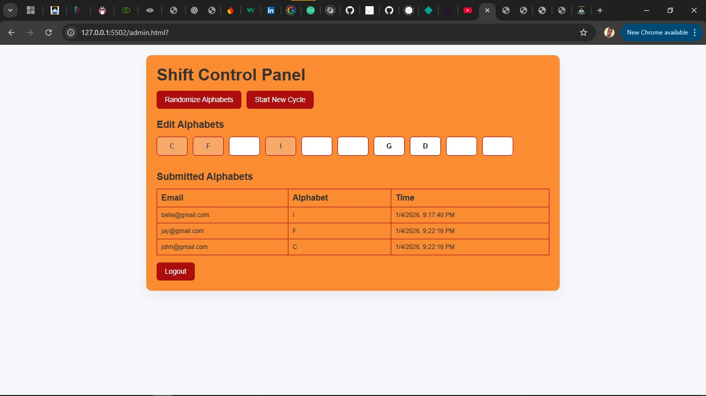
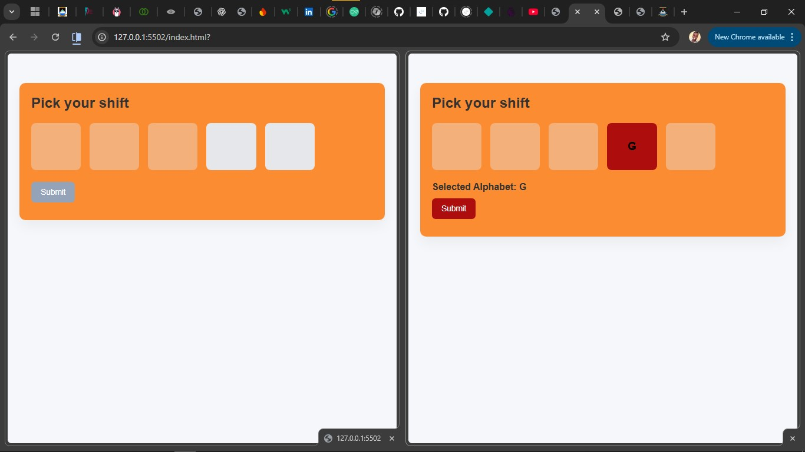

# Real-Time Shift Allocation System

A real-time shift allocation application built with Firebase Firestore, enabling controlled participant access and admin-managed selection cycles.

## Features

### Admin Panel
- Secure admin access
- Create and manage allocation cycles
- Edit and randomize alphabets
- View real-time participant submissions

### Participant Panel
- Allow-list email validation
- Real-time box locking
- One pick per cycle enforcement
- Hidden/unavailable selections prevented

## Tech Stack
- HTML, CSS, JavaScript
- Firebase Firestore
- Firebase Authentication (Admin)
- Firestore Transactions

## Key Concepts Demonstrated
- Real-time listeners (`onSnapshot`)
- Transaction-safe writes
- Client-side state management
- Admin/participant role separation
- Firestore data modeling

## Live Demo

## Screenshots

